# PyTorch-CV-Tools

## Use Cases

PyTorch-CV-Tools is a collection of tools to help facilitate computer vision operations.

Some of the tools in this library can be very useful to pre-process images before feeding to deep networks. However, the uses are not limited to pre-processing, you can perform a wide variety of operations that are helpful in many fields of work.

## Why?

The re-implementation of these tools in PyTorch has the advantage of being significantly faster than other libraries using NumPy, etc.

# Supported Operations

## Corner Detection (Harris)

    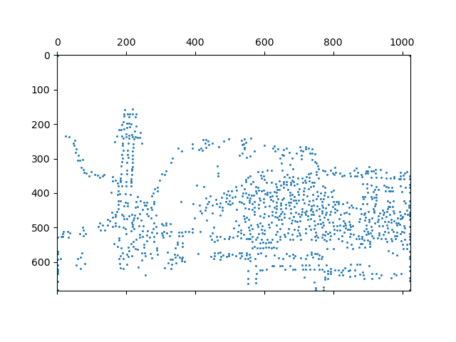
    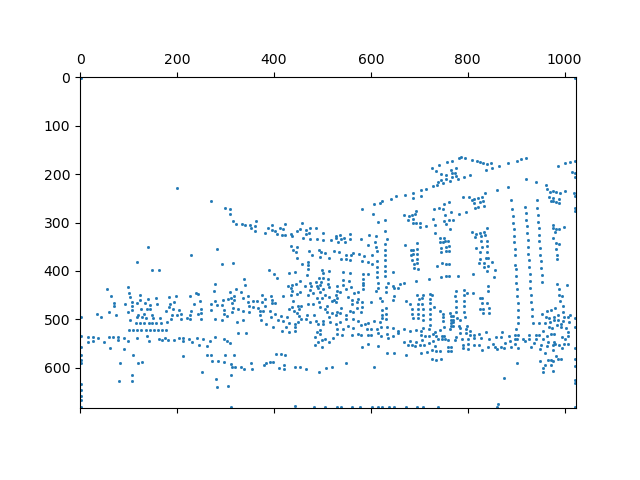

## Pair Matching (SIFT)

    
    

## Inlier Detection (RANSAC)

    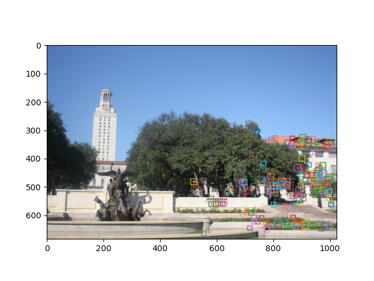
    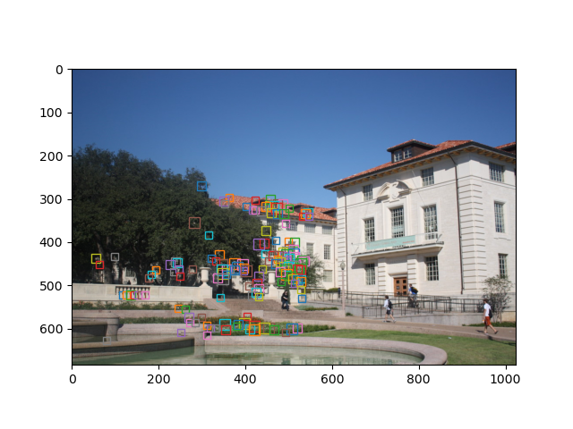

## Pixel Matching

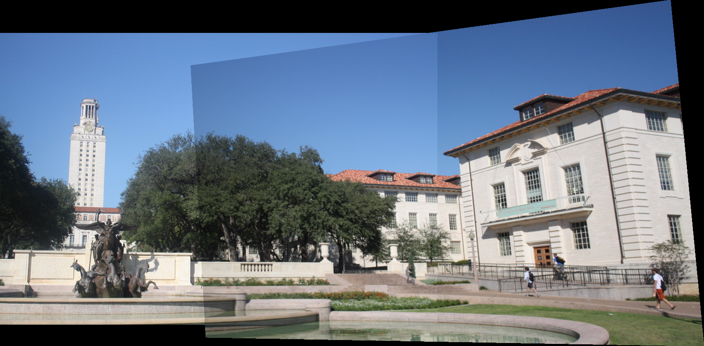

## N Image Stitching

This is an example of 3 images stitched together:

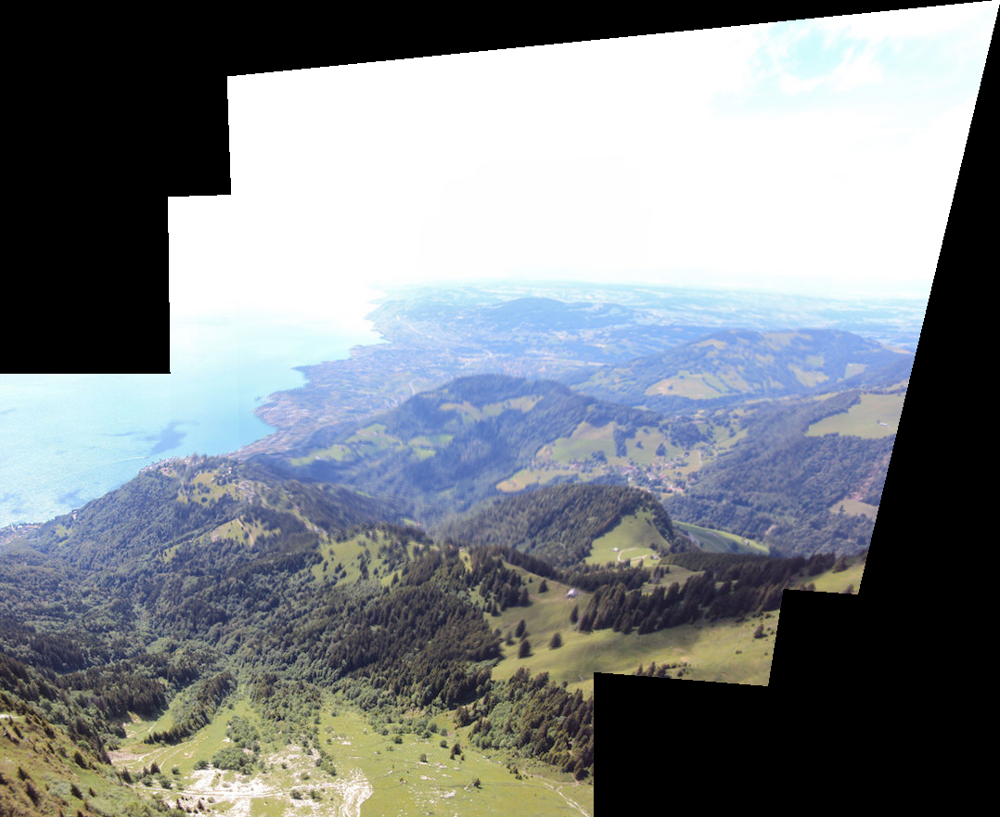

## Gaussian Smoothing

## Sharpening

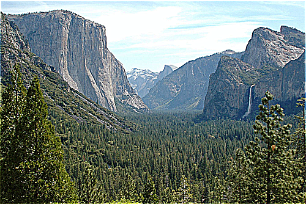

## Orientation

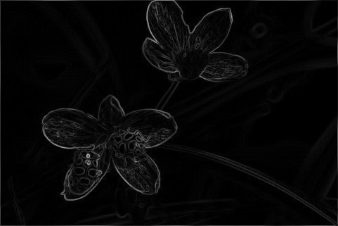

## Magnitude

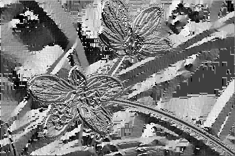

## Scaling (No Interpolation)

## Scaling (Bilinear Interpolation)

## Edge Detection (Canny)

    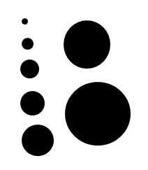
    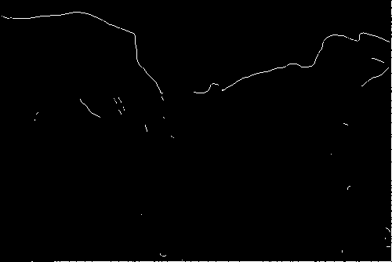

## Line Detection (Hough)

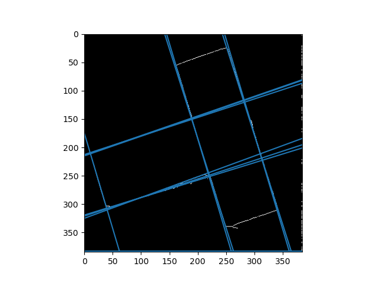
